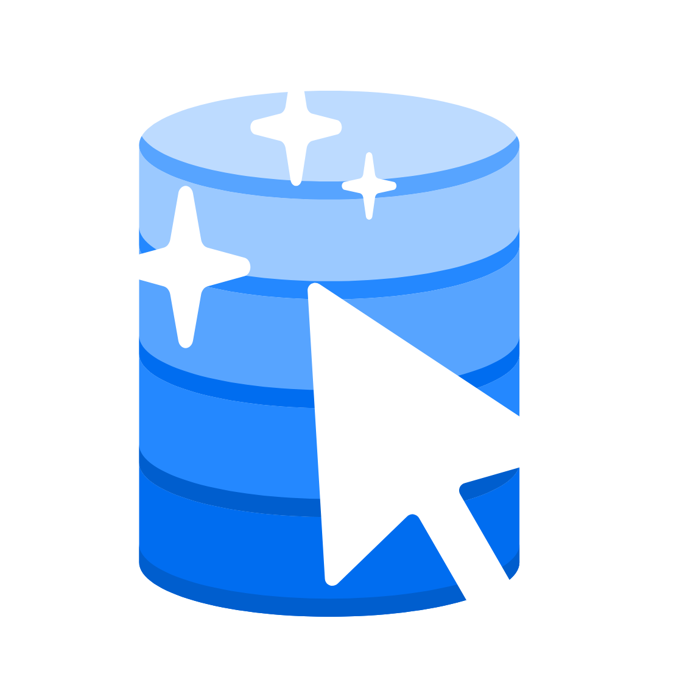
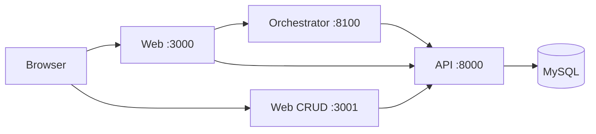

<p align="center">
  
</p>

<h1 align="center">LearningDB</h1>

<p align="center">
  AI-first learning tracker with Bayesian analysis.
</p>

<p align="center">
  
</p>

**LearningDB** is a personal learning workspace: track activities, manage data through a FastAPI backend, chat with an AI orchestrator that can query and update your records, and explore Bayesian analysis views — all from the browser.

Writes go through a two-step confirmation flow (preview → confirm token) with a table allowlist. Deletes are not allowed.

## Highlights

- **Activity tracking** — log and review learning activities per user
- **AI workspace** — LangChain orchestrator with tool-calling for reads and safe writes
- **Write-safe by design** — two-step confirmation, allowlisted tables, no deletes
- **Bayesian analysis** — priors, posteriors, and status updates in the UI
- **Import wizard** — CRUD-focused second UI for structured data import
- **Docker-first** — React, FastAPI, and MySQL stack via Compose from Docker Hub

## Quickstart

Prebuilt images are published under [`bancie`](https://hub.docker.com/u/bancie) (`learningdb-api`, `learningdb-orchestrator`, `learningdb-web`, `learningdb-web-second`).

```bash
cp .env.example .env   # set DB_PASS and at least one LLM API key
docker compose -f compose.hub.yml up -d
```

| Service | URL |
|---------|-----|
| Web | http://localhost:3000 |
| Web (CRUD / Import) | http://localhost:3001 |
| API | http://localhost:8000 |
| Orchestrator | http://localhost:8100 |
| MySQL | localhost:3308 |

Default seed user (override via env): `owner` / `learningdb-owner-1`.

## Architecture



The main web app talks to both the API and the orchestrator. The CRUD / import UI talks only to the API. The orchestrator calls the API for tool execution; the API owns MySQL.

## License

[MIT](LICENSE)
