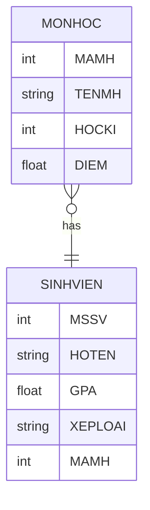

# LearningDB

## RDM

```mermaid
erDiagram
    MONHOC }o--|| SINHVIEN : has

    MONHOC {
        int MAMH
        string TENMH
        int HOCKI
        float DIEM
    }

    SINHVIEN {
        int MSSV
        string HOTEN
        float GPA
        string XEPLOAI
        int MAMH
    }
```