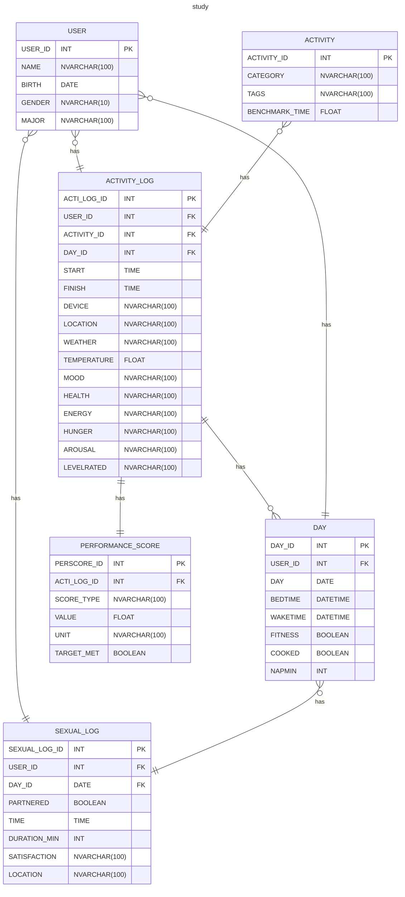

# RDM

```mermaid
---
title: study
---
erDiagram
    
    USER {
        USER_ID INT PK
        NAME NVARCHAR(100)
        BIRTH DATE
        GENDER NVARCHAR(10)
        MAJOR NVARCHAR(100)
    }

    ACTIVITY {
        ACTIVITY_ID INT PK
        CATEGORY NVARCHAR(100)
        TAGS NVARCHAR(100)
        BENCHMARK_TIME FLOAT
    }

    DAY {
        DAY_ID INT PK
        USER_ID INT FK
        DAY DATE
        BEDTIME DATETIME
        WAKETIME DATETIME
        FITNESS BOOLEAN
        COOKED BOOLEAN
        NAPMIN INT
    }

    ACTIVITY_LOG {
        ACTI_LOG_ID INT PK
        USER_ID INT FK
        ACTIVITY_ID INT FK
        DAY_ID INT FK
        START TIME
        FINISH TIME
        DEVICE NVARCHAR(100)
        LOCATION NVARCHAR(100)
        WEATHER NVARCHAR(100)
        TEMPERATURE FLOAT
        MOOD NVARCHAR(100)
        HEALTH NVARCHAR(100)
        ENERGY NVARCHAR(100)
        HUNGER NVARCHAR(100)
        AROUSAL NVARCHAR(100)
        LEVELRATED NVARCHAR(100)
    }

    PERFORMANCE_SCORE {
        PERSCORE_ID INT PK
        ACTI_LOG_ID INT FK
        SCORE_TYPE NVARCHAR(100)
        VALUE FLOAT
        UNIT NVARCHAR(100)
        TARGET_MET BOOLEAN
    }

    SEXUAL_LOG {
        SEXUAL_LOG_ID INT PK
        USER_ID INT FK
        DAY_ID DATE FK
        PARTNERED BOOLEAN
        TIME TIME
        DURATION_MIN INT
        SATISFACTION NVARCHAR(100)
        LOCATION NVARCHAR(100)
    }

    USER o{--|| ACTIVITY_LOG : has
    ACTIVITY o{--|| ACTIVITY_LOG : has
    ACTIVITY_LOG ||--|| PERFORMANCE_SCORE : has
    ACTIVITY_LOG ||--o{ DAY : has
    DAY ||--o{ USER : has
    USER o{--|| SEXUAL_LOG : has
    DAY o{--|| SEXUAL_LOG : has
```