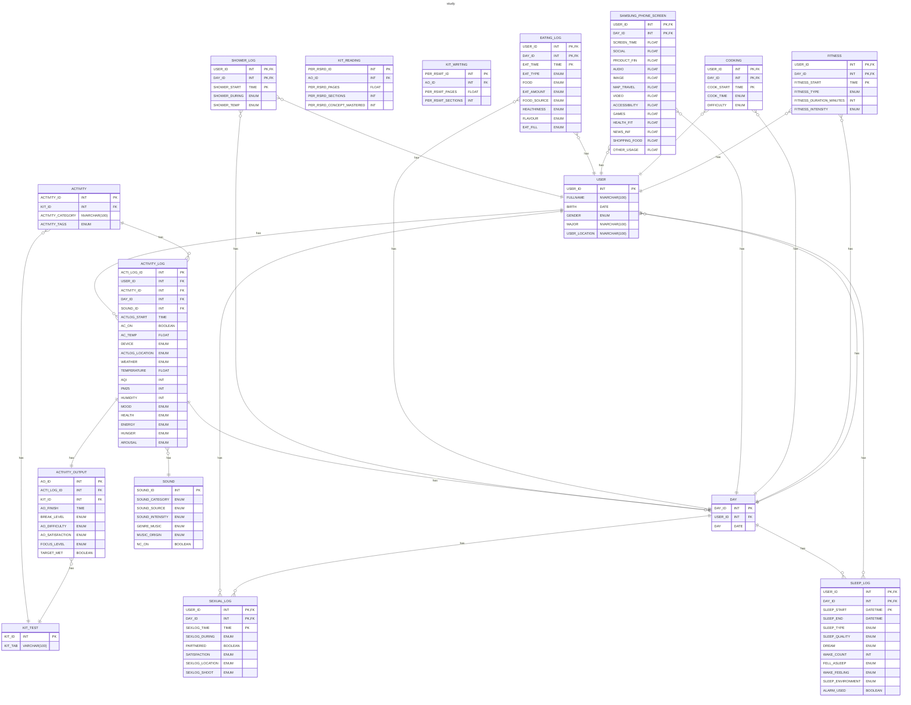

# RDM

## Define

### USER

- USER_ID
- FULLNAME
- BIRTH
- GENDER `male/female/other`
- MAJOR
- USER_LOCATION

### ACTIVITY

- ACTIVITY_ID
- KIT_ID INT FK
- ACTIVITY_CATEGORY
- ACTIVITY_TAGS `mental (Studying, reading, problem-solving)/productive (Work tasks, planning, organizing)/physical (Any bodily movement: exercise, walking, sex)/emotional (Journaling, meditating)/social (Chatting, meeting friends, calling someone)/entertainment (Watching videos, gaming, browsing social media)/other`

### DAY

- DAY_ID
- USER_ID
- DAY
- BEDTIME
- WAKETIME
- FITNESS `TRUA/FALSE`
- COOKED `TRUA/FALSE`

### ACTIVITY_LOG

- ACTI_LOG_ID
- USER_ID
- ACTIVITY_ID
- DAY_ID
- ACTLOG_START
- ACTLOG_FINISH
- AC_ON `TRUA/FALSE`
- AC_TEMP
- DEVICE `laptop/smartphone/book/tablet/other`
- ACTLOG_LOCATION `home/library/cafe/school/work/traveling/park/gym/other`
- WEATHER `stormy/rainy/cloudy/clear/sunny`
- TEMPERATURE `cold/normal/hot`
- AQI `check on ->` [IQAIR](https://www.iqair.com/vi/)
- PM25 `check on ->` [IQAIR](https://www.iqair.com/vi/)
- HUMIDITY `check on ->` [IQAIR](https://www.iqair.com/vi/)
- MOOD `angry/frustrated/depressed/very sad/sad/tired/neutral/content/happy/very happy/excited`
- HEALTH `poor/normal/good`
- ENERGY `low/normal/high`
- HUNGER `starving/very hungry/hungry/satisfied/full`
- AROUSAL `unresponsive (Not reacting at all)/low alert (Very sluggish, hard to focus)/drowsy (Sleepy, but responsive)/focused (Generally attentive)/hyper alert (Highly focused and energetic)`

### ACTIVITY_OUTPUT

- AO_ID
- ACTI_LOG_ID
- AO_FINISH
- BREAK_LEVEL `none/low/medium/high`
- AO_DIFFICULTY `effortless/very easy/easy/moderate/hard/very hard/overwhelming`
- AO_SATISFACTION `unsatisfied/neutral/satisfied`
- FOCUS_LEVEL `very low/low/medium/high/very high`
- TARGET_MET `TRUE/FALSE`

### SEXUAL_LOG

- USER_ID
- DAY_ID
- SEXLOG_TIME
- SEXLOG_DURING `short/medium/long`
- PARTNERED `TRUA/FALSE`
- SATISFACTION `very unsatisfied/unsatisfied/neutral/satisfied/very satisfied`
- SEXLOG_LOCATION `room/bedroom/bathroom/hotel/car/public place/living room/partner home/other`
- SEXLOG_SHOOT `none/very weak/weak/moderate/strong/explosive`

### SHOWER_LOG

- USER_ID
- DAY_ID
- SHOWER_START
- SHOWER_DURING `short/medium/long`
- SHOWER_TEMP `cold/warm/hot`

### EATING_LOG

- USER_ID
- DAY_ID
- EAT_TIME
- EAT_TYPE `breakfast/lunch/dinner/snack/supper (light meal late in the evening)/midnight snack/drinking`
- FOOD `main dish (rice, banh mi)/fast-food/junk-food (Candy, sugary cereal)/soup (Pho, noodle)/snack/side-dish (Fries, salad, kimchi)/dessert (Cake, ice cream, pudding)/beverage (Water, soda, coffee)/fruit/vegetable/other`
- EAT_AMOUNT `small/medium/large`
- FOOD_SOURCE `home cooked/ordered/takeaway/prepackaged (Ready-made from store)/friend made/canteen/outside/restaurant/other`
- HEALTHINESS `very unhealthy/unhealthy/neutral/healthy/super healthy`
- FLAVOUR `terrible/poor/average/delicious/very delicious`
- EAT_FILL `still hungry/not full/neutral/full/stuffed`

### SOUND

- SOUND_ID
- SOUND_CATEGORY `music/white-noise (Machine-generated or filtered static sounds)/ambient-noise (Environmental sounds like rain, café noise, street)/silence/podcast/construction/nature (Sounds like birds, wind, ocean)/unknown (Any unlisted or unclear sound type)`
- SOUND_SOURCE `headphones/earbuds/speakers/public (Sound from public environment e.g., café, library)/private room (Natural sound from your own space, e.g., bedroom)/unknown (You don’t remember or it’s unclear)`
- SOUND_INTENSITY `very low/low/medium/high/very high`
- GENRE_MUSIC `lo-fi/classical/jazz/pop/rock/edm/hip-hop/chill/ambient/instrumental/nature sounds/soundtrack/acoustic/random/other`
- MUSIC_ORIGIN `us-uk/vpop/kpop/jpop/cpop/euro-pop/latin/indie/mixed/random/other`
- NC_ON `TRUE/FALSE`

### SLEEP_LOG

- USER_ID
- DAY_ID
- SLEEP_START
- SLEEP_END
- SLEEP_TYPE `night/nap/recovery/fragmented/other`
- SLEEP_QUALITY `very poor (Constantly waking up, restless, unrefreshing sleep)/poor (Light or disrupted sleep, woke up tired)/fair (Slept okay, not fully rested)/good (Slept well, mostly uninterrupted)/very good (Deep sleep, woke up refreshed)/excellent (Best possible sleep — deep, long, and fully restorative)`
- DREAM `none (No dream remembered)/vague (Some memory of dreaming, but unclear or fragmented)/vivid (Clear, strong, and memorable dream)`
- WAKE_COUNT
- FELL_ASLEEP `easy/normal/difficult`
- WAKE_FEELING `very_groggy/groggy/neutral/refreshed/energized`
- SLEEP_ENVIRONMENT `terrible/poor/fair/good/excellent`
- ALARM_USED `TRUE/FALSE`

### SAMSUNG_PHONE_SCREEN

- USER_ID
- DAY_ID
- SCREEN_TIME
- SOCIAL
- PRODUCT_FIN
- AUDIO
- IMAGE
- MAP_TRAVEL
- VIDEO
- ACCESSIBILITY
- GAMES
- HEALTH_FIT
- NEWS_INF
- SHOPPING_FOOD
- OTHER_USAGE 

### FITNESS

- USER_ID
- DAY_ID
- FITNESS_START
- FITNESS_TYPE `walking/running/cycling/swimming/yoga/stretching/strength_training/bodyweight_training/sports/aerobic_dance/hiking/other`
- FITNESS_DURATION_MINUTES
- FITNESS_INTENSITY `low/moderate/high`

### COOKING

- USER_ID
- DAY_ID
- COOK_START
- COOK_TIME `short/medium/long`
- COOK_DIFFICULTY `easy/medium/hard`