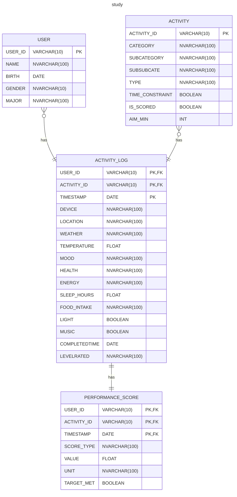

# RDM

```mermaid
---
title: study
---
erDiagram
    
    USER {
        USER_ID VARCHAR(10) PK
        NAME NVARCHAR(100)
        BIRTH DATE
        GENDER NVARCHAR(10)
        MAJOR NVARCHAR(100)
    }

    ACTIVITY {
        ACTIVITY_ID VARCHAR(10) PK
        CATEGORY NVARCHAR(100)
        SUBCATEGORY NVARCHAR(100)
        SUBSUBCATE NVARCHAR(100)
        TYPE NVARCHAR(100)
        TIME_CONSTRAINT BOOLEAN
        IS_SCORED BOOLEAN
        AIM_MIN INT
    }

    ACTIVITY_LOG {
        USER_ID VARCHAR(10) PK, FK
        ACTIVITY_ID VARCHAR(10) PK, FK
        TIMESTAMP DATE PK
        DEVICE NVARCHAR(100)
        LOCATION NVARCHAR(100)
        WEATHER NVARCHAR(100)
        TEMPERATURE FLOAT
        MOOD NVARCHAR(100)
        HEALTH NVARCHAR(100)
        ENERGY NVARCHAR(100)
        SLEEP_HOURS FLOAT
        FOOD_INTAKE NVARCHAR(100)
        LIGHT BOOLEAN
        MUSIC BOOLEAN
        COMPLETEDTIME DATE
        LEVELRATED NVARCHAR(100)
    }

    PERFORMANCE_SCORE {
        USER_ID VARCHAR(10) PK, FK
        ACTIVITY_ID VARCHAR(10) PK, FK
        TIMESTAMP DATE PK, FK
        SCORE_TYPE NVARCHAR(100)
        VALUE FLOAT
        UNIT NVARCHAR(100)
        TARGET_MET BOOLEAN
    }

    USER o{--|| ACTIVITY_LOG : has
    ACTIVITY o{--|| ACTIVITY_LOG : has
    ACTIVITY_LOG ||--|| PERFORMANCE_SCORE : has
```