# RDM

```mermaid
---
title: study
---
erDiagram
    
    USER {
        USER_ID INT PK
        FULLNAME NVARCHAR(100)
        BIRTH DATE
        GENDER ENUM
        MAJOR NVARCHAR(100)
        USER_LOCATION NVARCHAR(100)
    }
    
    KIT_TEST {
        KIT_ID INT PK
        KIT_TAB VARCHAR(100)
    }

    ACTIVITY {
        ACTIVITY_ID INT PK
        USER_ID INT FK
        ACT_NAME NVARCHAR(100)
        ACTIVITY_TAGS ENUM
        ACTIVITY_CATEGORY ENUM
        IS_RESEARCH BOOLEAN
        KIT_ID INT FK
        ACT_STATUS ENUM
    }

    DAY {
        DAY_ID INT PK
        USER_ID INT FK
        DAY DATE
        IS_EVENT BOOLEAN
        IS_FREE BOOLEAN
    }

    SAMSUNG_PHONE_SCREEN {
        USER_ID INT PK, FK
        DAY_ID INT PK, FK
        SCREEN_TIME FLOAT
        SOCIAL FLOAT
    }

    SLEEP_LOG {
        USER_ID INT PK, FK
        DAY_ID INT PK, FK
        SLEEP_START DATETIME PK
        SLEEP_END DATETIME
        SLEEP_TYPE ENUM
        SLEEP_QUALITY ENUM
        DREAM ENUM
        WAKE_COUNT INT
        FELL_ASLEEP ENUM
        WAKE_FEELING ENUM
        SLEEP_ENVIRONMENT ENUM
        ALARM_USED BOOLEAN
    }

    ACTIVITY_LOG {
        ACTI_LOG_ID INT PK
        USER_ID INT FK
        ACTIVITY_ID INT FK
        DAY_ID INT FK
        ACTLOG_START TIME
        SOUND_BACKGROUND SET
        SOUND_INTENSITY ENUM
        DEVICE ENUM
        ACTLOG_LOCATION ENUM
        WEATHER ENUM
        TEMPERATURE FLOAT
        MOOD ENUM
        HEALTH ENUM
        ENERGY ENUM
        HUNGER ENUM
        AROUSAL ENUM
        AC_ON BOOLEAN
    }

    ACTIVITY_OUTPUT {
        AO_ID INT PK
        ACTI_LOG_ID INT FK
        KIT_ID INT FK
        AO_FINISH TIME
        BREAK_TIME INT
        AO_SATISFACTION ENUM
        FOCUS_LEVEL ENUM
        TARGET_MET BOOLEAN
    }

    KIT_ACADEMIC_READING {
       AO_ID INT PK, FK
       COMPREHENSION_DEPTH ENUM
       PROOF_TRACE_ABILITY ENUM
       LINKING_TO_PREVIOUS_KNOWLEDGE ENUM
       MENTAL_FATIGUE ENUM
       READING_SPEED_FOR_PROOF ENUM
       READING_AMOUNT ENUM
       CONTENT_LEVEL ENUM
       SPEED_READ ENUM
    }

    KIT_IELTS_LISTENING {
       AO_ID INT PK, FK
       SCORE_BAND FLOAT
       COMPREHENSION_TYPE ENUM
       TOPIC_FAMILIARITY ENUM
       SPEED_HANDLING ENUM
       SPELLING_ACCURACY ENUM
       ANSWER_COMPLETION ENUM
       AUDIO_RECOGNITION ENUM
    }

    KIT_IELTS_READING {
        AO_ID INT PK, FK
        SCORE_BAND FLOAT
        COMPREHENSION_TYPE ENUM
        TIME_MANAGEMENT ENUM
        READING_SPEED ENUM
        COMPREHENSION_DEPTH ENUM
        TEXT_COMPLEXITY_HANDLING ENUM
        VOCABULARY_RECOGNITION ENUM
        ANSWER_ACCURACY ENUM
    }

    KIT_IELTS_WRITING_TASK1 {
       AO_ID INT PK, FK
       TASK_ACHIEVEMENT ENUM
       COHERENCE_COHESION ENUM
       LEXICAL_RESOURCE ENUM
       GRAMMATICAL_RANGE_ACCURACY ENUM
       TONE_FORMALITY ENUM
       VISUAL_DESCRIPTION_SKILL ENUM
    }

    KIT_IELTS_WRITING_TASK2 {
       AO_ID INT PK, FK
       TASK_RESPONSE ENUM
       COHERENCE_COHESION ENUM 
       LEXICAL_RESOURCE ENUM
       GRAMMATICAL_RANGE_ACCURACY ENUM
       ARGUMENT_QUALITY ENUM
       IDEAS_ORIGINALITY ENUM
       COUNTERARGUMENT_HANDLING ENUM
    }

    KIT_IELTS_SPEAKING {
       AO_ID INT PK, FK
       FLUENCY_COHE​​SION ENUM
       LEXICAL_RESOURCE ENUM
       GRAMMATICAL_RANGE_ACCURACY ENUM
       PRONUNCIATION ENUM
       IDEA_ORGANIZATION ENUM
       TOPIC_HANDLING ENUM
       INTERACTIVE_COMMUNICATION ENUM
       CONFIDENCE_LEVEL ENUM
    }

    KIT_RESEARCH_WRITING {
       AO_ID INT PK, FK
       AMOUNT_WRITTEN ENUM
       ORIGINALITY ENUM
       STRUCTURE ENUM
    }

    KIT_EXERCISES {
        AO_ID INT PK, FK
        TOTAL_QUESTION INT
        TRUE_TOTAL INT
        TIME_FINISH ENUM
    }

    SEXUAL_LOG {
        USER_ID INT PK, FK
        DAY_ID INT PK, FK
        SEXLOG_TIME TIME PK
        SEXLOG_DURING ENUM
        PARTNERED BOOLEAN
        SATISFACTION ENUM
        SEXLOG_LOCATION ENUM
        SEXLOG_SHOOT ENUM
    }

    SHOWER_LOG {
        USER_ID INT PK, FK
        DAY_ID INT PK, FK
        SHOWER_START TIME PK
        SHOWER_DURING ENUM
        SHOWER_TEMP ENUM
    }
    
    FITNESS {
        USER_ID INT PK, FK
        DAY_ID INT PK, FK
        FITNESS_START TIME PK
        FITNESS_TYPE ENUM
        FITNESS_DURATION_MINUTES INT
        FITNESS_INTENSITY ENUM
    }

    EATING_LOG {
        USER_ID INT PK, FK
        DAY_ID INT PK, FK
        EAT_TIME TIME PK
        EAT_TYPE ENUM
        FOOD ENUM
        EAT_AMOUNT ENUM
        FOOD_SOURCE ENUM
        HEALTHINESS ENUM
        FLAVOUR ENUM
        EAT_FILL ENUM
    }

    USER ||--o{ ACTIVITY_LOG : has
    ACTIVITY ||--o{ ACTIVITY_LOG : has
    ACTIVITY_LOG ||--|| ACTIVITY_OUTPUT : has
    ACTIVITY_LOG ||--o{ DAY : has
    DAY ||--o{ USER : has
    USER ||--o{ SEXUAL_LOG : has
    DAY ||--o{ SEXUAL_LOG : has
    SHOWER_LOG o{--|| USER : has
    SHOWER_LOG o{--|| DAY : has
    EATING_LOG o{--|| USER : has
    EATING_LOG o{--|| DAY : has
    SAMSUNG_PHONE_SCREEN o{--|| USER : has
    SAMSUNG_PHONE_SCREEN o{--|| DAY : has
    DAY ||--o{ SLEEP_LOG : has
    USER ||--o{ SLEEP_LOG : has
    FITNESS o{--|| USER : has
    FITNESS o{--|| DAY : has
    ACTIVITY o{--|| KIT_TEST : has
    ACTIVITY_OUTPUT o{--|| KIT_TEST : has
    ACTIVITY_OUTPUT ||--|| KIT_ACADEMIC_READING : has
    ACTIVITY_OUTPUT ||--|| KIT_IELTS_LISTENING : has
    ACTIVITY_OUTPUT ||--|| KIT_IELTS_READING : has
    ACTIVITY_OUTPUT ||--|| KIT_IELTS_WRITING_TASK1 : has
    ACTIVITY_OUTPUT ||--|| KIT_IELTS_WRITING_TASK2 : has
    ACTIVITY_OUTPUT ||--|| KIT_IELTS_SPEAKING : has
    ACTIVITY_OUTPUT ||--|| KIT_EXERCISES : has
    ACTIVITY_OUTPUT ||--|| KIT_RESEARCH_WRITING : has
```

## Define

### USER

- USER_ID
- FULLNAME
- BIRTH
- GENDER `male/female/other`
- MAJOR
- USER_LOCATION

### ACTIVITY

- ACTIVITY_ID
- USER_ID
- ACT_NAME
- ACTIVITY_TAGS `mental (Studying, reading, problem-solving)/productive (Work tasks, planning, organizing)/physical (Any bodily movement: exercise, walking, sex)/emotional (Journaling, meditating)/social (Chatting, meeting friends, calling someone)/entertainment (Watching videos, gaming, browsing social media)/other`
- ACTIVITY_CATEGORY `academic/language/self-development/technical_&_vocational/creative_arts/well-being_&_lifestyle`
- IS_RESEARCH `TRUE/FALSE`
- KIT_ID
- ACT_STATUS `not_started/in_progress/paused/completed/closed/skipped/cancelled/failed`

### DAY

- DAY_ID
- USER_ID
- DAY
- BEDTIME
- WAKETIME
- FITNESS `TRUA/FALSE`
- COOKED `TRUA/FALSE`

### ACTIVITY_LOG

- ACTI_LOG_ID
- USER_ID
- ACTIVITY_ID
- DAY_ID
- SOUND_BACKGROUND `category_music/category_white_noise/category_ambient_noise/category_silence/category_podcast/category_construction/category_nature/source_headphones/source_earbuds/source_speakers/source_public/source_private_room`
- SOUND_INTENSITY `silent/very_low/low/medium/high/very_high`
- DEVICE `laptop/smartphone/book/tablet/other`
- ACTLOG_LOCATION `home/library/cafe/school/work/traveling/park/gym/other`
- WEATHER `stormy/rainy/cloudy/clear/sunny`
- TEMPERATURE `freezing/cold/cool/mild/warm/hot/very_hot/scorching`
- MOOD `angry/frustrated/depressed/very_sad/sad/tired/neutral/content/happy/very_happy/excited`
- HEALTH `poor/normal/good`
- ENERGY `exhausted/low/normal/high/bursting`
- HUNGER `starving/extreme_hungry/very_hungry/slightly_hungry/satisfied/full/overstuffed`
- AROUSAL `unresponsive (Not reacting at all)/low_alert (Very sluggish, hard to focus)/drowsy (Sleepy, but responsive)/focused (Generally attentive)/hyper_alert (Highly focused and energetic)`
- AC_ON `TRUA/FALSE`
- ACTLOG_START

### ACTIVITY_OUTPUT

- AO_ID
- ACTI_LOG_ID
- AO_FINISH
- BREAK_TIME
- AO_SATISFACTION `very_unsatisfied/unsatisfied/neutral/satisfied/very_satisfied`
- FOCUS_LEVEL `very_low/low/medium/high/very_high`
- TARGET_MET `TRUE/FALSE`

### SEXUAL_LOG

- USER_ID
- DAY_ID
- SEXLOG_TIME
- SEXLOG_DURING `short/medium/long`
- PARTNERED `TRUA/FALSE`
- SATISFACTION `very unsatisfied/unsatisfied/neutral/satisfied/very satisfied`
- SEXLOG_LOCATION `room/bedroom/bathroom/hotel/car/public place/living room/partner home/other`
- SEXLOG_SHOOT `none/very weak/weak/moderate/strong/explosive`

### SHOWER_LOG

- USER_ID
- DAY_ID
- SHOWER_START
- SHOWER_DURING `short/medium/long`
- SHOWER_TEMP `cold/warm/hot`

### EATING_LOG

- USER_ID
- DAY_ID
- EAT_TIME
- EAT_TYPE `breakfast/lunch/dinner/snack/supper (light meal late in the evening)/midnight snack/drinking`
- FOOD `main dish (rice, banh mi)/fast-food/junk-food (Candy, sugary cereal)/soup (Pho, noodle)/snack/side-dish (Fries, salad, kimchi)/dessert (Cake, ice cream, pudding)/beverage (Water, soda, coffee)/fruit/vegetable/other`
- EAT_AMOUNT `small/medium/large`
- FOOD_SOURCE `home cooked/ordered/takeaway/prepackaged (Ready-made from store)/friend made/canteen/outside/restaurant/other`
- HEALTHINESS `very unhealthy/unhealthy/neutral/healthy/super healthy`
- FLAVOUR `terrible/poor/average/delicious/very delicious`
- EAT_FILL `still hungry/not full/neutral/full/stuffed`

### SOUND

- SOUND_ID
- SOUND_CATEGORY `music/white-noise (Machine-generated or filtered static sounds)/ambient-noise (Environmental sounds like rain, café noise, street)/silence/podcast/construction/nature (Sounds like birds, wind, ocean)/unknown (Any unlisted or unclear sound type)`
- SOUND_SOURCE `headphones/earbuds/speakers/public (Sound from public environment e.g., café, library)/private_room (Natural sound from your own space, e.g., bedroom)/unknown (You don’t remember or it’s unclear)`
- SOUND_INTENSITY `very_low/low/medium/high/very_high`
- GENRE_MUSIC `lo-fi/classical/jazz/pop/rock/edm/hip-hop/chill/ambient/instrumental/nature_sounds/soundtrack/acoustic/random/other`
- MUSIC_ORIGIN `us-uk/vpop/kpop/jpop/cpop/euro-pop/latin/indie/mixed/random/other`
- NC_ON `TRUE/FALSE`

### SLEEP_LOG

- USER_ID
- DAY_ID
- SLEEP_START
- SLEEP_END
- SLEEP_TYPE `night/nap/recovery/fragmented/other`
- SLEEP_QUALITY `very poor (Constantly waking up, restless, unrefreshing sleep)/poor (Light or disrupted sleep, woke up tired)/fair (Slept okay, not fully rested)/good (Slept well, mostly uninterrupted)/very good (Deep sleep, woke up refreshed)/excellent (Best possible sleep — deep, long, and fully restorative)`
- DREAM `none (No dream remembered)/vague (Some memory of dreaming, but unclear or fragmented)/vivid (Clear, strong, and memorable dream)`
- WAKE_COUNT
- FELL_ASLEEP `easy/normal/difficult`
- WAKE_FEELING `very_groggy/groggy/neutral/refreshed/energized`
- SLEEP_ENVIRONMENT `terrible/poor/fair/good/excellent`
- ALARM_USED `TRUE/FALSE`

### SAMSUNG_PHONE_SCREEN

- USER_ID
- DAY_ID
- SCREEN_TIME
- SOCIAL

### FITNESS

- USER_ID
- DAY_ID
- FITNESS_START
- FITNESS_TYPE `walking/running/cycling/swimming/yoga/stretching/strength_training/bodyweight_training/sports/aerobic_dance/hiking/other`
- FITNESS_DURATION_MINUTES
- FITNESS_INTENSITY `low/moderate/high`

### KIT_ACADEMIC_READING

- KIT_ACADEMIC_READING_ID
- COMPREHENSION_DEPTH `surface_level/partial_understanding/understood_core_ideas/grasped_all_arguments/deep_and_connected_insight`
- PROOF_TRACE_ABILITY `non-proof/lost_immediately/followed_some_steps/mostly_followed/fully_followed/followed_and_critiqued`
- LINKING_TO_PREVIOUS_KNOWLEDGE `no_connection_made/forced_linking/some_connections/natural_linking/integrated_into_framework`
- MENTAL_FATIGUE `exhausted_quickly/tired_early/moderately_fatigued/sustained_attention/deep_focus_maintained`
- READING_SPEED_FOR_PROOF `non-proof/extremely_slow/slow/average/fast/very_fast_with_understanding`
- READING_AMOUNT `none/barely_any/light/moderate/substantial/intensive/extensive`
- CONTENT_LEVEL `introductory/elementary/intermediate/advanced/expert`
- SPEED_READ `extremely_slow/very_slow/slow/average/fast/very_fast/ultra_fast_memorized`

### KIT_IELTS_LISTENING

- KIT_IELTS_LISTENING_ID
- SCORE_BAND 
- COMPREHENSION_TYPE `multiple_choice/form_completion/map_diagram/matching/sentence_completion/summary_completion/short_answer`
- TOPIC_FAMILIARITY `very_unfamiliar/unfamiliar/neutral/familiar/very_familiar`
- SPEED_HANDLING `lost/struggled/managed_okay/comfortable/fluent_response`
- SPELLING_ACCURACY `poor/needs_improvement/adequate/good/perfect`
- ANSWER_COMPLETION `mostly_blank/partially_filled/mostly_filled/fully_filled_but_incorrect/fully_correct`
- AUDIO_RECOGNITION `missed_info/some_misheard/understood_main_ideas/understood_details/complete_understanding`

### KIT_IELTS_READING

- KIT_IELTS_READING_ID
- SCORE_BAND 
- COMPREHENSION_TYPE `matching_headings/multiple_choice/true_false_not_given/yes_no_not_given/summary_completion/sentence_completion/note_table_flowchart_completion/short_answer`
- TIME_MANAGEMENT `ran_out_of_time/barely_finished/just_in_time/finished_early/finished_with_review`
- READING_SPEED `very_slow/slow/average/fast/very_fast`
- COMPREHENSION_DEPTH `missed_main_ideas/got_main_ideas/understood_details/inferred_meanings/mastered_all_levels`
- TEXT_COMPLEXITY_HANDLING `too_difficult/challenging/just_right/easy/too_easy`
- VOCABULARY_RECOGNITION `very_limited/limited/moderate/strong/expert`
- ANSWER_ACCURACY `mostly_wrong/some_correct/about_half_correct/mostly_correct/all_correct`

### KIT_IELTS_WRITING_TASK1

- KIT_IELTS_WRITING_TASK1_ID
- TASK_ACHIEVEMENT `off_topic/insufficient_data_coverage/partial_summary/clear_summary/fully_meets_requirements`
- COHERENCE_COHESION `no_logical_flow/some_linking/adequate_organization/logical_and_effective/seamless_and_engaging`
- LEXICAL_RESOURCE `basic_words_only/repetitive/moderate_range/varied_and_precise/advanced_and_natural`
- GRAMMATICAL_RANGE_ACCURACY `many_errors/basic_structures_only/mostly_correct/some_complex_structures/complex_and_accurate`
- TONE_FORMALITY `too_informal/slightly_informal/appropriate/formal/perfectly_matched`
- VISUAL_DESCRIPTION_SKILL `missing_comparison/basic_reporting/some_comparison/well_analyzed/insightful_and_concise`

### KIT_IELTS_WRITING_TASK2

- KIT_IELTS_WRITING_TASK2_ID
- TASK_RESPONSE `off_topic/weak_argument/partially_addressed/clearly_addressed/fully_developed`
- COHERENCE_COHESION `no_logical_flow/some_linking/adequate_organization/logical_and_effective/seamless_and_engaging`
- LEXICAL_RESOURCE `basic_words_only/repetitive/moderate_range/varied_and_precise/advanced_and_natural`
- GRAMMATICAL_RANGE_ACCURACY `many_errors/basic_structures_only/mostly_correct/some_complex_structures/complex_and_accurate`
- ARGUMENT_QUALITY `no_argument/weak_claims/some_support/well_supported/convincing_and_logical`
- IDEAS_ORIGINALITY `very_common/somewhat_generic/some_freshness/original_and_thoughtful/highly_creative`
- COUNTERARGUMENT_HANDLING `none/weak_or_forced/acknowledged/refuted_effectively/masterfully_addressed`

### KIT_IELTS_SPEAKING

- KIT_IELTS_SPEAKING_ID
- FLUENCY_COHE​​SION `frequent_pauses/hesitant/some_disfluency/mostly_fluent/naturally_fluent`
- LEXICAL_RESOURCE `very_basic_words/repetitive/some_range/wide_range/rich_and_precise`
- GRAMMATICAL_RANGE_ACCURACY `frequent_errors/simple_only/moderate_range/accurate_with_complex/wide_and_consistent_accuracy`
- PRONUNCIATION `unclear/hard_to_understand/mostly_clear/clear_and_natural/native_like`
- IDEA_ORGANIZATION `no_structure/jumpy/basic_sequence/clear_flow/well_structured`
- TOPIC_HANDLING `off_topic/barely_on_topic/partially_developed/developed/insightful_response`
- INTERACTIVE_COMMUNICATION `minimal/reluctant/adequate/responsive/engaging_and_natural`
- CONFIDENCE_LEVEL `very_nervous/nervous/neutral/confident/very_confident`

### KIT_RESEARCH_WRITING

- AO_ID
- AMOUNT_WRITTEN `tiny/short/moderate/substantial/intensive`
- ORIGINALITY `descriptive/emergent/creative/original_rigorous`
- STRUCTURE `fragmented/loose/mostly_structured/clear/excellent`

### KIT_EXERCISES

- AO_ID
- TOTAL_QUESTION
- TRUE_TOTAL
- TIME_FINISH `no_time_recorded/too_slow/a_bit_slow/acceptable/a_bit_fast/fast_and_confident`