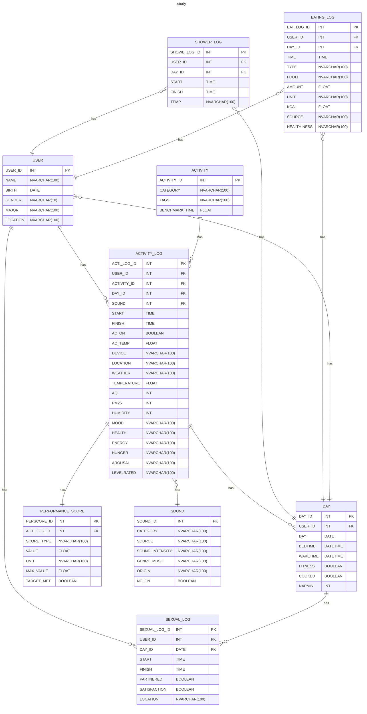

# RDM

## Define

### USER

- USER_ID
- NAME
- BIRTH
- GENDER `male/female/other`
- MAJOR
- LOCATION

### ACTIVITY

- ACTIVITY_ID
- CATEGORY
- TAGS `mental (Studying, reading, problem-solving)/productive (Work tasks, planning, organizing)/physical (Any bodily movement: exercise, walking, sex)/emotional (Journaling, meditating)/social (Chatting, meeting friends, calling someone)/entertainment (Watching videos, gaming, browsing social media)/other`
- BENCHMARK_TIME

### DAY

- DAY_ID
- USER_ID
- DAY
- BEDTIME
- WAKETIME
- FITNESS `TRUA/FALSE`
- COOKED `TRUA/FALSE`
- NAPMIN

### ACTIVITY_LOG

- ACTI_LOG_ID
- USER_ID
- ACTIVITY_ID
- DAY_ID
- START
- FINISH
- AC_ON `TRUA/FALSE`
- AC_TEMP
- DEVICE `laptop/smartphone/book/tablet/other`
- LOCATION `home/library/cafe/school/work/traveling/park/gym/other`
- WEATHER `stormy/rainy/cloudy/clear/sunny`
- TEMPERATURE `cold/normal/hot`
- AQI `check on ->` [IQAIR](https://www.iqair.com/vi/)
- PM25 `check on ->` [IQAIR](https://www.iqair.com/vi/)
- HUMIDITY `check on ->` [IQAIR](https://www.iqair.com/vi/)
- MOOD `angry/frustrated/depressed/very sad/sad/tired/neutral/content/happy/very happy/excited`
- HEALTH `poor/normal/good`
- ENERGY `low/normal/high`
- HUNGER `starving/very hungry/hungry/satisfied/full`
- AROUSAL `unresponsive (Not reacting at all)/low alert (Very sluggish, hard to focus)/drowsy (Sleepy, but responsive)/focused (Generally attentive)/hyper alert (Highly focused and energetic)`
- LEVELRATED `very poor (Didn’t understand or complete the task)/poor (Struggled and made many mistakes)/fair (Did it okay, but there’s room for improvement)/good (Did it well with minor issues)/excellent (Completed it successfully and confidently)`

### PERFORMANCE_SCORE

- PERSCORE_ID
- ACTI_LOG_ID
- SCORE_TYPE `practice/test/assignment/self-evaluation/peer-evaluation/teacher-feedback/presentation/project/other`
- VALUE
- UNIT `points (85/100)/percentage/stars/grade (A,B,C)/level (level 3)/minutes/hours/sec/rank (2nd place)/scale-10 (7.8/10)/scale-5 (4/5)/boolean (pass, fail, yes, no)/count (pages, chapters, pushups)/words/tasks (6 per 10 tasks done)/steps/none`
- MAX_VALUE
- TARGET_MET `TRUE/FALSE`

### SEXUAL_LOG

- SEXUAL_LOG_ID
- USER_ID
- DAY_ID
- START
- FINISH
- PARTNERED `TRUA/FALSE`
- SATISFACTION `TRUA/FALSE`
- LOCATION `room/bedroom/bathroom/hotel/car/public place/living room/partner home/other`

### SHOWER_LOG

- SHOWER_LOG_ID
- USER_ID
- DAY_ID
- START
- FINISH
- TEMP `cold/warm/hot`

### EATING_LOG

- EAT_LOG_ID
- USER_ID
- DAY_ID
- TIME
- TYPE `breakfast/lunch/dinner/snack/supper (light meal late in the evening)/midnight snack/drinking`
- FOOD `main dish (rice, banh mi)/fast-food/junk-food (Candy, sugary cereal)/soup (Pho, noodle)/snack/side-dish (Fries, salad, kimchi)/dessert (Cake, ice cream, pudding)/beverage (Water, soda, coffee)/fruit/vegetable/other`
- AMOUNT
- UNIT `gr/ml/bowls/cups/pieces/slices/plates/servings`
- KCAL
- SOURCE `home cooked/ordered/takeaway/prepackaged (Ready-made from store)/friend made/canteen/outside/restaurant/other`
- HEALTHINESS `very unhealthy/unhealthy/neutral/healthy/super healthy`

### SOUND

- SOUND_ID
- CATEGORY `music/white-noise (Machine-generated or filtered static sounds)/ambient-noise (Environmental sounds like rain, café noise, street)/silence/podcast/construction/nature (Sounds like birds, wind, ocean)/unknown (Any unlisted or unclear sound type)`
- SOURCE `headphones/earbuds/speakers/public (Sound from public environment e.g., café, library)/private room (Natural sound from your own space, e.g., bedroom)/unknown (You don’t remember or it’s unclear)`
- SOUND_INTENSITY `very low/low/medium/high/very high`
- GENRE_MUSIC `lo-fi/classical/jazz/pop/rock/edm/hip-hop/chill/ambient/instrumental/nature sounds/soundtrack/acoustic/other`
- ORIGIN `us-uk/vpop/kpop/jpop/cpop/euro-pop/latin/indie/mixed/other`
- NC_ON `TRUE/FALSE`