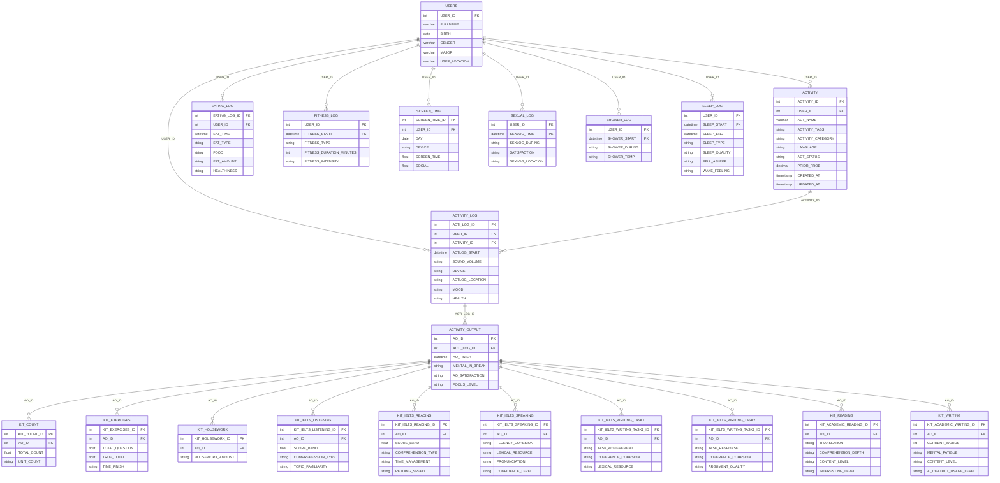

# LearningDB System

## Database

Sơ đồ ER (từ `output.dbml`) dưới dạng Mermaid:

```mermaid
erDiagram
    USERS ||--o{ ACTIVITY : "USER_ID"
    USERS ||--o{ ACTIVITY_LOG : "USER_ID"
    USERS ||--o{ EATING_LOG : "USER_ID"
    USERS ||--o{ FITNESS_LOG : "USER_ID"
    USERS ||--o{ SCREEN_TIME : "USER_ID"
    USERS ||--o{ SEXUAL_LOG : "USER_ID"
    USERS ||--o{ SHOWER_LOG : "USER_ID"
    USERS ||--o{ SLEEP_LOG : "USER_ID"
    ACTIVITY ||--o{ ACTIVITY_LOG : "ACTIVITY_ID"
    ACTIVITY_LOG ||--o{ ACTIVITY_OUTPUT : "ACTI_LOG_ID"
    ACTIVITY_OUTPUT ||--o{ KIT_COUNT : "AO_ID"
    ACTIVITY_OUTPUT ||--o{ KIT_EXERCISES : "AO_ID"
    ACTIVITY_OUTPUT ||--o{ KIT_HOUSEWORK : "AO_ID"
    ACTIVITY_OUTPUT ||--o{ KIT_IELTS_LISTENING : "AO_ID"
    ACTIVITY_OUTPUT ||--o{ KIT_IELTS_READING : "AO_ID"
    ACTIVITY_OUTPUT ||--o{ KIT_IELTS_SPEAKING : "AO_ID"
    ACTIVITY_OUTPUT ||--o{ KIT_IELTS_WRITING_TASK1 : "AO_ID"
    ACTIVITY_OUTPUT ||--o{ KIT_IELTS_WRITING_TASK2 : "AO_ID"
    ACTIVITY_OUTPUT ||--o{ KIT_READING : "AO_ID"
    ACTIVITY_OUTPUT ||--o{ KIT_WRITING : "AO_ID"

    USERS {
        int USER_ID PK
        varchar FULLNAME
        date BIRTH
        varchar GENDER
        varchar MAJOR
        varchar USER_LOCATION
    }

    ACTIVITY {
        int ACTIVITY_ID PK
        int USER_ID FK
        varchar ACT_NAME
        string ACTIVITY_TAGS
        string ACTIVITY_CATEGORY
        string LANGUAGE
        string ACT_STATUS
        decimal PRIOR_PROB
        timestamp CREATED_AT
        timestamp UPDATED_AT
    }

    ACTIVITY_LOG {
        int ACTI_LOG_ID PK
        int USER_ID FK
        int ACTIVITY_ID FK
        datetime ACTLOG_START
        string SOUND_VOLUME
        string DEVICE
        string ACTLOG_LOCATION
        string MOOD
        string HEALTH
    }

    ACTIVITY_OUTPUT {
        int AO_ID PK
        int ACTI_LOG_ID FK
        datetime AO_FINISH
        string MENTAL_IN_BREAK
        string AO_SATISFACTION
        string FOCUS_LEVEL
    }

    EATING_LOG {
        int EATING_LOG_ID PK
        int USER_ID FK
        datetime EAT_TIME
        string EAT_TYPE
        string FOOD
        string EAT_AMOUNT
        string HEALTHINESS
    }

    FITNESS_LOG {
        int USER_ID PK
        datetime FITNESS_START PK
        string FITNESS_TYPE
        int FITNESS_DURATION_MINUTES
        string FITNESS_INTENSITY
    }

    KIT_COUNT {
        int KIT_COUNT_ID PK
        int AO_ID FK
        float TOTAL_COUNT
        string UNIT_COUNT
    }

    KIT_EXERCISES {
        int KIT_EXERCISES_ID PK
        int AO_ID FK
        float TOTAL_QUESTION
        float TRUE_TOTAL
        string TIME_FINISH
    }

    KIT_HOUSEWORK {
        int KIT_HOUSEWORK_ID PK
        int AO_ID FK
        string HOUSEWORK_AMOUNT
    }

    KIT_IELTS_LISTENING {
        int KIT_IELTS_LISTENING_ID PK
        int AO_ID FK
        float SCORE_BAND
        string COMPREHENSION_TYPE
        string TOPIC_FAMILIARITY
    }

    KIT_IELTS_READING {
        int KIT_IELTS_READING_ID PK
        int AO_ID FK
        float SCORE_BAND
        string COMPREHENSION_TYPE
        string TIME_MANAGEMENT
        string READING_SPEED
    }

    KIT_IELTS_SPEAKING {
        int KIT_IELTS_SPEAKING_ID PK
        int AO_ID FK
        string FLUENCY_COHESION
        string LEXICAL_RESOURCE
        string PRONUNCIATION
        string CONFIDENCE_LEVEL
    }

    KIT_IELTS_WRITING_TASK1 {
        int KIT_IELTS_WRITING_TASK1_ID PK
        int AO_ID FK
        string TASK_ACHIEVEMENT
        string COHERENCE_COHESION
        string LEXICAL_RESOURCE
    }

    KIT_IELTS_WRITING_TASK2 {
        int KIT_IELTS_WRITING_TASK2_ID PK
        int AO_ID FK
        string TASK_RESPONSE
        string COHERENCE_COHESION
        string ARGUMENT_QUALITY
    }

    KIT_READING {
        int KIT_ACADEMIC_READING_ID PK
        int AO_ID FK
        string TRANSLATION
        string COMPREHENSION_DEPTH
        string CONTENT_LEVEL
        string INTERESTING_LEVEL
    }

    KIT_WRITING {
        int KIT_ACADEMIC_WRITING_ID PK
        int AO_ID FK
        int CURRENT_WORDS
        string MENTAL_FATIGUE
        string CONTENT_LEVEL
        string AI_CHATBOT_USAGE_LEVEL
    }

    SCREEN_TIME {
        int SCREEN_TIME_ID PK
        int USER_ID FK
        date DAY
        string DEVICE
        float SCREEN_TIME
        float SOCIAL
    }

    SEXUAL_LOG {
        int USER_ID PK
        datetime SEXLOG_TIME PK
        string SEXLOG_DURING
        string SATISFACTION
        string SEXLOG_LOCATION
    }

    SHOWER_LOG {
        int USER_ID PK
        datetime SHOWER_START PK
        string SHOWER_DURING
        string SHOWER_TEMP
    }

    SLEEP_LOG {
        int USER_ID PK
        datetime SLEEP_START PK
        datetime SLEEP_END
        string SLEEP_TYPE
        string SLEEP_QUALITY
        string FELL_ASLEEP
        string WAKE_FEELING
    }
```

_(Nguồn: chuyển từ `output.dbml`. Các enum và chi tiết cột đầy đủ xem trong file DBML gốc.)_
