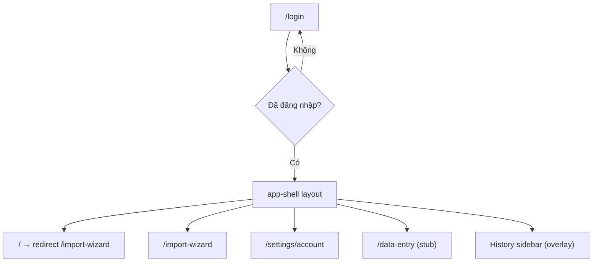

# Architecture Review — `learningdb-second-app`

> **Issue:** PER-5147 — Review codebase và refactor learningdb-second-app  
> **Ngày review:** 2026-06-18

## 1. Tổng quan kiến trúc hiện tại

`learningdb-second-app` là frontend thử nghiệm cho workflow **CRUD + Import Wizard** của LearningDB, dùng chung FastAPI backend (`/api` port 8000), **không** dùng LangChain orchestrator.

### Tech stack

| Lớp | Công nghệ |
|-----|-----------|
| Framework | React Router 7 (SSR) + Vite 8 |
| Runtime / package manager | Bun |
| UI | Tailwind CSS 4 + design tokens Stitch (`design-tokens.ts`, `app.css`) |
| HTTP | Axios (`withCredentials` cho session cookie) |
| State | React Context + local `useState` (không Redux / React Query) |

### Cấu trúc thư mục

```
app/
├── routes.ts              # Định nghĩa route
├── routes/                # Page components (login, app-shell, import-wizard, …)
├── services/              # API client monolith (api.ts)
├── auth/                  # AuthProvider + session
├── import-wizard/         # Domain module: wizard fields, utils, draft, dialogs
├── history/               # Sidebar lịch sử + dialog chỉnh sửa
├── components/ui/         # Primitives Tailwind (button, card, input, …)
├── lib/                   # Utilities (cn)
├── utils/                 # formatApiError
└── design-tokens.ts       # Stitch tokens
```

### Luồng route



### Điểm mạnh của kiến trúc hiện tại

1. **Feature folders** — `import-wizard/`, `history/`, `auth/` tách domain rõ ràng hơn main app (`learningdb/`).
2. **Auth thật** — cookie session, route guard trong `app-shell.tsx`, không hardcode `userId`.
3. **Design system nhất quán** — tokens Stitch + `components/ui/*` thay vì phụ thuộc MUI.
4. **`formatApiError`** — xử lý lỗi FastAPI `detail` tập trung.
5. **Server draft** — wizard draft lưu qua API (`/import-wizard/draft`), không chỉ localStorage.
6. **Schema-driven forms** — `WizardFields` + `table-utils` render field theo column metadata từ backend.

---

## 2. Code smells đã phát hiện

### 2.1 Critical — thiếu module `~/lib/cn`

**Mô tả:** 11 file import `~/lib/cn` nhưng file không tồn tại → `bun run typecheck` fail.

**Trạng thái:** ✅ Đã sửa trong PR này (`app/lib/cn.ts`).

---

### 2.2 God Component — `routes/import-wizard.tsx` (~1100 dòng)

**Mô tả:** Một component chứa toàn bộ:

- 20+ `useState`
- Schema bootstrap
- Draft load/save
- 4 step handlers (insert tuần tự)
- Stepper navigation rules
- Confirm dialogs
- Toast / error UI
- JSX cho 4 bước wizard

**Hậu quả:** Khó test, khó review, dễ regression khi thêm bước mới.

**Đề xuất refactor:**

```
import-wizard/
├── useImportSchema.ts       # ✅ Đã tách — load tables + columns
├── useImportWizardState.ts  # State machine cho step, IDs, form values
├── useImportWizardActions.ts# Handlers: next, finish, discard, save draft
├── ImportWizardStepper.tsx
├── steps/
│   ├── ActivityLogStep.tsx
│   ├── ActivityOutputStep.tsx
│   ├── KitCountStep.tsx
│   └── KitReadingStep.tsx
└── WizardFooter.tsx         # Nút Back / Save / Next dùng chung
```

**Pattern đề xuất:** **State Machine** (XState hoặc reducer thuần) cho wizard flow vì có nhiều rule chuyển bước (không skip, không back từ step 4, v.v.).

---

### 2.3 Duplicated schema bootstrap

**Mô tả:** Logic `resolveImportTables()` + `getTableColumns()` lặp lại ở `import-wizard.tsx` và `HistoryDetailDialog.tsx`.

**Trạng thái:** ✅ Đã tách `useImportSchema` hook.

---

### 2.4 Duplicated constants (omit columns)

**Mô tả:** `new Set(["USER_ID", "ACTIVITY_ID"])` và tương tự được copy ở 2 nơi.

**Trạng thái:** ✅ Đã tách `import-wizard/constants.ts`.

---

### 2.5 Monolithic API layer — `services/api.ts` (~270 dòng)

**Mô tả:** Một file chứa types + 30+ endpoint functions cho tables, activities, bayes, auth, history, import-wizard draft.

**Hậu quả:** Khó navigate, merge conflict, không mirror domain boundaries.

**Đề xuất refactor:**

```
services/
├── http.ts           # axios instance + resolveApiBaseUrl
├── tables.ts         # CRUD generic tables
├── activities.ts     # /activities/*
├── auth.ts           # /auth/*
├── history.ts        # /history/logging/*
├── drafts.ts         # /import-wizard/draft
├── bayes.ts          # /bayes/*, /update/*
└── index.ts          # re-export (giữ import path ~/services/api)
```

**Pattern:** **Repository / Service layer** — mỗi domain một module, route chỉ gọi service.

---

### 2.6 Duplicated column-type logic với main app

**Mô tả:** `WizardFields` + `table-utils` (`isNumericType`, `buildInsertPayload`, …) overlap với `learningdb/app/components/table-record-fields.tsx`.

**Hậu quả:** Bug fix ở một app không tự sync sang app kia (ví dụ xử lý MySQL `SET`, `TIME` vs `DATETIME`).

**Đề xuất:** Trích xuất package nội bộ `packages/table-fields/` hoặc copy có test shared giữa hai app.

---

### 2.7 Inline confirm modal markup (4+ chỗ)

**Mô tả:** Cùng pattern overlay + card + 2 nút lặp ở import-wizard, app-shell logout, history delete.

**Trạng thái:** ✅ Đã tách `components/ui/confirm-dialog.tsx` (2-action). Dialog 3-action (unsaved changes) giữ custom cho đến khi có `ConfirmDialog` mở rộng.

---

### 2.8 Client-side auth guard thay vì loader

**Mô tả:** `app-shell.tsx` dùng `useEffect` redirect khi `!user`:

```tsx
React.useEffect(() => {
  if (loading || user) return;
  navigate("/login", { replace: true });
}, [loading, user, navigate]);
```

**Hậu quả:** Flash "Redirecting to login…", không tận dụng SSR loader của React Router 7.

**Đề xuất:** Dùng **route `clientLoader`** hoặc `loader` gọi `getAuthMe()` và `redirect()` — pattern chuẩn của React Router data APIs.

---

### 2.9 Không có data-fetching cache / invalidation chuẩn

**Mô tả:** Mỗi mở history sidebar → fetch lại. `HistoryRefreshProvider` dùng version counter thủ công.

**Đề xuất:** **TanStack Query** cho `getLoggingHistory`, `getTableColumns`, v.v. — invalidation tự nhiên sau mutation.

---

### 2.10 Dead / stub routes

| Route | Trạng thái |
|-------|------------|
| `/data-entry` | Stub, chỉ hiện token info |
| Bayes / activity-list / data-browser | Có ở main app, chưa port sang second-app |

**Đề xuất:** Hoặc implement, hoặc xóa khỏi nav cho đến khi cần — tránh "ghost routes".

---

### 2.11 API endpoints không dùng trong UI

`api.ts` export nhiều hàm chưa được second-app gọi:

- `getActivityList`, `getActivityView`, `getCurrentActivityLog`
- `updatePrior`, `updatePosterior`, `runBayes`, `checkPrior`
- `listTableRows` / `updateTableRow` / `deleteTableRow` (ngoài activity picker)

**Đề xuất:** Tách sang module riêng hoặc generate client từ OpenAPI (`design/stitch-context/openapi.snapshot.json`) để chỉ expose endpoint thực sự dùng.

---

### 2.12 Sequential insert không transactional

**Mô tả:** Step 3/4 insert từng row trong vòng `for` — nếu row 2 fail, row 1 đã commit.

**Đề xuất:** Backend endpoint batch insert hoặc transaction wrapper; frontend chỉ gọi một API.

---

### 2.13 README vs code mismatch

README nhắc `app/theme.ts` nhưng file không tồn tại. README nói MUI nhưng package.json không có MUI.

**Đề xuất:** Cập nhật README cho khớp implementation.

---

## 3. Design patterns đề xuất

### 3.1 Kiến trúc tổng thể (target state)

```
┌─────────────────────────────────────────────────────────┐
│  Routes (thin) — meta, layout, compose features         │
├─────────────────────────────────────────────────────────┤
│  Features (import-wizard, history, auth)                │
│    ├── components/                                      │
│    ├── hooks/         ← business logic                  │
│    ├── services/      ← gọi API domain                  │
│    └── types/                                           │
├─────────────────────────────────────────────────────────┤
│  Shared (components/ui, lib, utils)                     │
├─────────────────────────────────────────────────────────┤
│  services/http.ts → FastAPI                             │
└─────────────────────────────────────────────────────────┘
```

### 3.2 Patterns theo concern

| Concern | Pattern hiện tại | Đề xuất |
|---------|------------------|---------|
| Routing | File-based RR7 | Giữ + thêm `clientLoader` auth |
| API | Monolith axios | **Repository per domain** |
| Forms | Schema-driven render | **Shared table-fields package** |
| Wizard flow | useState spaghetti | **State machine / useReducer** |
| Auth | Context + useEffect guard | **Loader redirect** + Context |
| Server state | Manual fetch + version bump | **TanStack Query** |
| UI primitives | Tailwind components | Giữ + mở rộng `ConfirmDialog`, `Toast` |
| Error handling | `formatApiError` | Giữ + optional error boundary per feature |
| Draft persistence | Server API | Giữ — đã đúng hướng |

### 3.3 So sánh với `learningdb/` (main app)

| Khía cạnh | Main app | Second app | Hướng đồng bộ |
|-----------|----------|------------|---------------|
| UI library | MUI 7 | Tailwind Stitch | Giữ khác biệt có chủ đích |
| Auth | Hardcoded user | Session cookie | Main app nên adopt auth |
| Chat / AI | Orchestrator | Không có | Second app không cần |
| CRUD pages | Đầy đủ | Chỉ import wizard | Port từ main khi cần |
| Form fields | `table-record-fields` | `WizardFields` | **Shared extraction** |
| Error util | Inline | `formatApiError` | Main app adopt |

---

## 4. Lộ trình refactor đề xuất

### Phase 0 — Fixes nhanh (PR này)

- [x] Thêm `app/lib/cn.ts`
- [x] Tách `useImportSchema`, `constants.ts`, `ConfirmDialog`
- [x] Tài liệu review này

### Phase 1 — Tách import wizard (ưu tiên cao)

1. `useImportWizardState` + `useImportWizardActions`
2. Tách 4 step components
3. State machine cho navigation rules
4. Unit test cho `table-utils` (validation, payload build)

### Phase 2 — API layer

1. Split `api.ts` theo domain
2. OpenAPI codegen client (script `fetch-openapi.sh` đã có)
3. Loại bỏ unused exports

### Phase 3 — Data fetching & auth

1. TanStack Query setup
2. `clientLoader` auth trên `app-shell`
3. Thay `HistoryRefreshProvider` bằng query invalidation

### Phase 4 — Feature parity & shared libs

1. Quyết định fate của `/data-entry`
2. Extract shared `table-fields` package
3. Port CRUD routes từ main app nếu MVP yêu cầu

---

## 5. Kết luận

`learningdb-second-app` có nền tảng tốt: feature folders, auth, design tokens, schema-driven wizard. Vấn đề chính là **concentration of complexity** trong `import-wizard.tsx` và **monolithic API module**, cùng một số duplication với main app.

Refactor nên theo hướng **thin routes + fat feature hooks + domain services**, không rewrite toàn bộ. PR hiện tại thực hiện Phase 0 và làm mẫu cho các bước tiếp theo.
