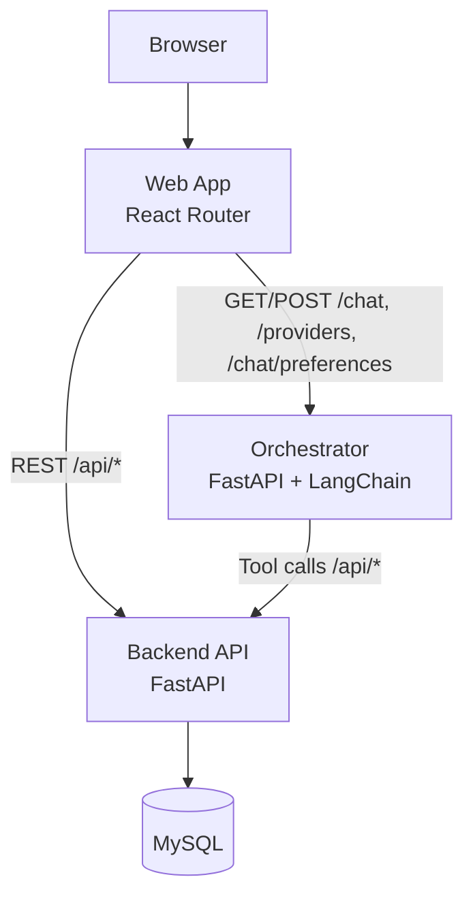

# LearningDB

Ứng dụng theo dõi học tập + phân tích Bayes, gồm 4 lớp chính: `web`, `api`, `orchestrator`, `db`.

README này mô tả phiên bản hiện tại của hệ thống: kiến trúc, module, file structure, cách chạy, và cách dùng chatbot với cơ chế write-safe 2 bước (chỉ thêm/sửa, không xóa).

## Mục lục

- [1. Tổng quan](#1-tổng-quan)
- [2. Kiến trúc hệ thống](#2-kiến-trúc-hệ-thống)
- [3. Cấu trúc thư mục](#3-cấu-trúc-thư-mục)
- [4. Module và trách nhiệm](#4-module-và-trách-nhiệm)
- [5. API và contracts](#5-api-và-contracts)
- [6. Write-safe 2 bước (no-delete)](#6-write-safe-2-bước-no-delete)
- [7. Cài đặt và chạy](#7-cài-đặt-và-chạy)
- [8. Cách sử dụng nhanh](#8-cách-sử-dụng-nhanh)
- [9. Test và kiểm chứng](#9-test-và-kiểm-chứng)
- [10. Troubleshooting](#10-troubleshooting)

## 1. Tổng quan

LearningDB cung cấp:

- Theo dõi hoạt động học tập theo người dùng.
- CRUD dữ liệu ở backend (UI/manual + API).
- Chatbot orchestrator (LangChain) để truy vấn và thực hiện add/update qua tool-calling.
- Cơ chế an toàn cho write: xác nhận 2 bước, allowlist bảng, không cho delete.

### Tech stack

| Layer | Tech |
| --- | --- |
| Web | React 19, React Router 7, TypeScript, MUI |
| Orchestrator | FastAPI, LangChain, HTTPX |
| API Backend | FastAPI, SQLAlchemy, Pandas |
| DB | MySQL |
| Runtime | Docker Compose / local CLI |

## 2. Kiến trúc hệ thống



### Luồng chính

- Web gọi orchestrator để chat.
- Orchestrator gọi LLM + tools.
- Tools gọi backend API.
- Backend thao tác DB.

## 3. Cấu trúc thư mục

```text
LearningDB/
├── compose.yml
├── requirements.txt
├── .env
├── .env.example
└── learningdb/
    ├── README.md
    ├── Dockerfile                     # web image
    ├── app/                           # frontend
    │   ├── routes/
    │   │   ├── workspace.tsx          # chat workspace state machine
    │   │   ├── home.tsx               # chat UI
    │   │   ├── import.tsx
    │   │   ├── update.tsx
    │   │   └── ...
    │   ├── services/
    │   │   ├── orchestrator.ts        # orchestrator client/contracts
    │   │   └── api.ts
    │   └── components/
    │       └── chat/...
    ├── backend/
    │   ├── main.py                    # REST endpoints
    │   ├── crud.py                    # DB logic
    │   ├── database.py
    │   └── cli.py                     # learningdb serve
    └── orchestrator/
        ├── app.py                     # /health, /providers, /chat...
        ├── chains/agent.py            # tool-calling loop
        ├── tools/
        │   ├── registry.py            # tool registry read/write
        │   ├── models.py              # pydantic input schemas
        │   └── http_client.py
        ├── guardrails.py              # allowlist & safety checks
        ├── write_phase.py             # confirmation token + preview
        ├── schemas.py                 # ChatRequest/Response contracts
        └── tests/
```

## 4. Module và trách nhiệm

### Web (`learningdb/app`)

- `routes/workspace.tsx`
  - Quản lý state chat, conversation history, provider/model, gửi request chat.
  - Nối flow xác nhận 2 bước: giữ `confirmation_token`, gửi token khi user xác nhận.
- `services/orchestrator.ts`
  - Contract TypeScript cho `ChatRequest`, `ChatResponse`, `action_preview`.

### Backend API (`learningdb/backend`)

- `main.py`: routing `GET/POST/PATCH/... /api/*`.
- `crud.py`: nghiệp vụ SQL cụ thể.
- Các endpoint write đã có:
  - `POST /api/tables/insert`
  - `PATCH /api/tables/{table_name}/rows`
  - `POST /api/update/prior`
  - `POST /api/update/posterior`
  - `POST /api/update/status`

### Orchestrator (`learningdb/orchestrator`)

- `app.py`
  - API chat-facing: `/chat`, `/providers`, `/chat/preferences/*`, `/chat/conversations/*`.
- `chains/agent.py`
  - Vòng lặp tool-calling với allowlist guardrails.
  - Bật write khi `allow_write=true`.
  - Tích hợp xác nhận 2 bước cho write.
- `tools/registry.py`
  - Định nghĩa read/write tools và mapping endpoint backend.
- `guardrails.py`
  - Chặn tool ngoài allowlist.
  - Chặn write nếu `allow_write=false`.
  - Giới hạn bảng được phép ghi qua `ORCH_WRITE_TABLE_ALLOWLIST`.
- `write_phase.py`
  - Tạo `action_preview`.
  - Ký/verify token xác nhận bằng HMAC + TTL.

## 5. API và contracts

### Backend base

- `http://localhost:8000/api`

### Orchestrator base

- `http://localhost:8100`

### Chat request (orchestrator)

`POST /chat`

```json
{
  "user_id": 1,
  "message": "Cap nhat status activity_id 1 thanh done",
  "conversation_id": "optional",
  "history": [],
  "provider": "anthropic",
  "model": "claude-sonnet-4-6",
  "allow_write": true,
  "confirmation_token": "optional-step-2-token"
}
```

### Chat response (orchestrator)

- `answer`, `tool_invocations`, `warnings`
- Có thể có `action_preview` khi write cần xác nhận.

## 6. Write-safe 2 bước (no-delete)

Hệ thống write qua chatbot chỉ cho **add/update**, không cho delete.

### Step 1: Preview

- User gửi yêu cầu write (`allow_write=true`).
- Agent nhận intent write và trả:
  - `warnings: ["write_confirmation_required"]`
  - `action_preview` gồm:
    - `action_type`
    - `summary`
    - `confirmation_token`
    - `proposed_payload`
- Chưa thực thi write.

### Step 2: Confirm

- User xác nhận.
- Web gửi request mới kèm `confirmation_token`.
- Orchestrator verify:
  - chữ ký token
  - hạn token (TTL)
  - user/action/payload khớp
- Hợp lệ thì mới thực thi write tool.

### Chính sách no-delete

- Không đăng ký delete tools trong registry.
- Guardrail deny-by-default với tool ngoài allowlist.
- Prompt write mode cũng cấm delete/remove.

## 7. Cài đặt và chạy

### 7.1 Yêu cầu

- Node.js 20+
- Python 3.12/3.13 khuyến nghị
- Docker (nếu chạy compose)

### 7.2 Chạy full stack bằng Docker Compose

Từ thư mục gốc project:

```bash
docker compose up --build
```

Endpoints:

- Web: `http://localhost:3000`
- API: `http://localhost:8000`
- API docs: `http://localhost:8000/docs`
- Orchestrator health: `http://localhost:8100/health`
- DB host port: `localhost:3308`

### 7.3 Chạy local dev 1 lệnh (web + api)

```bash
source learningdb/backend/.venv/bin/activate
learningdb serve
```

Mặc định:

- Web dev: `http://localhost:5173`
- API: `http://localhost:8000`

## 8. Cách sử dụng nhanh

### Chat read-only

1. Mở workspace chat.
2. Chọn provider/model.
3. Gửi câu hỏi truy vấn dữ liệu.

### Chat add/update (2 bước xác nhận)

1. Gửi yêu cầu write (thêm/sửa).
2. Nhận preview action.
3. Xác nhận để thực thi (hoặc hủy).

### API test nhanh

```bash
curl -s http://localhost:8100/providers
curl -s http://localhost:8100/health
```

## 9. Test và kiểm chứng

### Orchestrator test suite

```bash
docker compose run --rm orchestrator sh -lc 'PYTHONPATH=/app python -m pytest orchestrator/tests -q'
```

Các nhóm test chính:

- guardrails allow/deny
- HTTP client retry/PATCH
- write phase token/preview/verify
- registry write tools
- app chat endpoint

### E2E gợi ý

- Case read: query data không write.
- Case write step-1: nhận `action_preview`.
- Case write step-2: gửi token, write được thực thi.
- Case delete intent: bị từ chối theo policy.

## 10. Troubleshooting

### `No module named langchain_anthropic`

- Đảm bảo rebuild orchestrator image sau khi update dependency:

```bash
docker compose up -d --build orchestrator
```

### Chat timeout khi gọi model

- Tăng `ORCH_REQUEST_TIMEOUT_SECONDS` trong `.env` (ví dụ `45`).

### Write không chạy

- Kiểm tra:
  - `allow_write=true`
  - request step-2 có `confirmation_token`
  - token chưa hết hạn
  - bảng nằm trong `ORCH_WRITE_TABLE_ALLOWLIST`

### Cổng bị chiếm

```bash
lsof -i :3000
lsof -i :5173
lsof -i :8000
lsof -i :8100
```

---

Private project for personal learning and experimentation.
