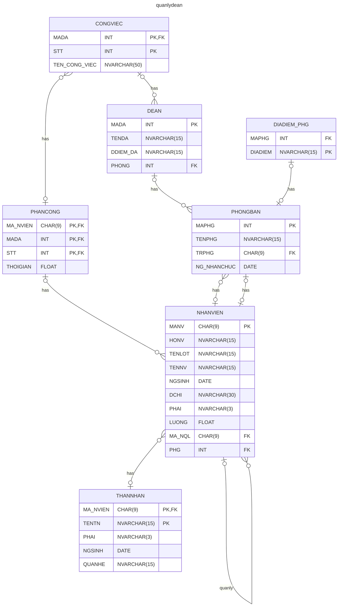

# RDM

```mermaid
---
title: quanlydean
---
erDiagram

CONGVIEC {
    MADA INT PK, FK
    STT INT PK
    TEN_CONG_VIEC NVARCHAR(50)
}

PHANCONG {
    MA_NVIEN CHAR(9) PK, FK
    MADA INT PK, FK
    STT INT PK, FK
    THOIGIAN FLOAT
}

DEAN {
    MADA INT PK
    TENDA NVARCHAR(15)
    DDIEM_DA NVARCHAR(15)
    PHONG INT FK
}

PHONGBAN {
    MAPHG INT PK
    TENPHG NVARCHAR(15)
    TRPHG CHAR(9) FK
    NG_NHANCHUC DATE
}

NHANVIEN {
    MANV CHAR(9) PK
    HONV NVARCHAR(15)
    TENLOT NVARCHAR(15)
    TENNV NVARCHAR(15)
    NGSINH DATE
    DCHI NVARCHAR(30)
    PHAI NVARCHAR(3)
    LUONG FLOAT
    MA_NQL CHAR(9) FK
    PHG INT FK
}

DIADIEM_PHG {
    MAPHG INT FK
    DIADIEM NVARCHAR(15) PK
}

THANNHAN {
    MA_NVIEN CHAR(9) PK, FK
    TENTN NVARCHAR(15) PK
    PHAI NVARCHAR(3)
    NGSINH DATE
    QUANHE NVARCHAR(15)
}

CONGVIEC o|--}o DEAN : has
CONGVIEC }o--o| PHANCONG : has
PHANCONG |o--}o NHANVIEN : has
DEAN o|--}o PHONGBAN : has
PHONGBAN }o--|o NHANVIEN : has
PHONGBAN |o--|o NHANVIEN : has
DIADIEM_PHG |o--|o PHONGBAN : has
NHANVIEN }o--|o THANNHAN : has
NHANVIEN |o--}o NHANVIEN : quanly
```