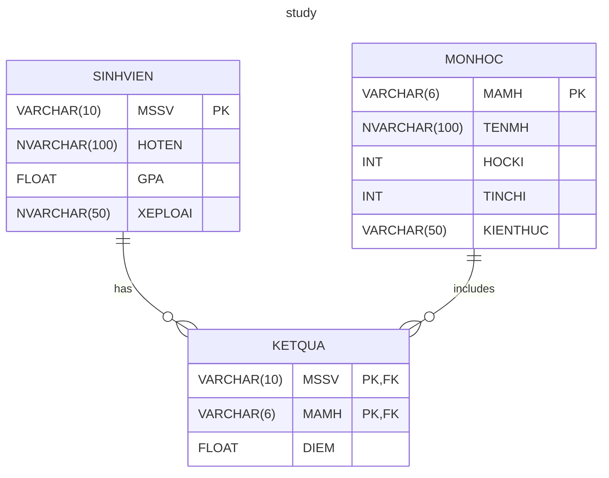

# RDM

```mermaid
---
title: study
---
erDiagram
    MONHOC {
        VARCHAR(6) MAMH PK
        NVARCHAR(100) TENMH
        INT HOCKI
        INT TINCHI
        VARCHAR(50) KIENTHUC
    }

    SINHVIEN {
        VARCHAR(10) MSSV PK
        NVARCHAR(100) HOTEN
        FLOAT GPA
        NVARCHAR(50) XEPLOAI
    }

    KETQUA {
        VARCHAR(10) MSSV PK, FK
        VARCHAR(6) MAMH PK, FK
        FLOAT DIEM
    }

    SINHVIEN ||--o{ KETQUA : has
    MONHOC   ||--o{ KETQUA : includes
```