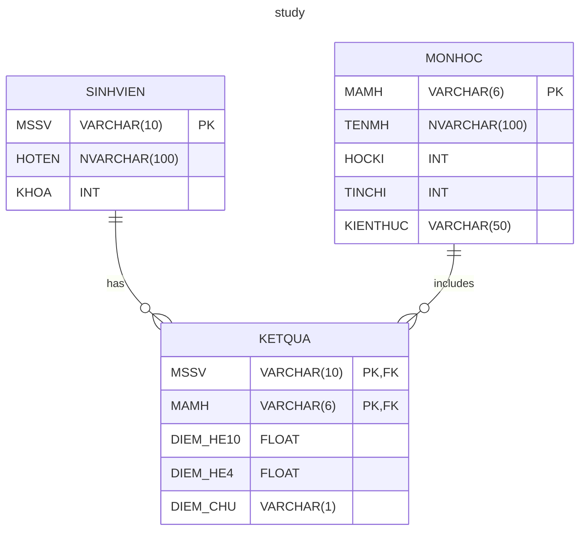

# RDM

```mermaid
---
title: study
---
erDiagram
    MONHOC {
        MAMH VARCHAR(6) PK
        TENMH NVARCHAR(100)
        HOCKI INT
        TINCHI INT
        KIENTHUC VARCHAR(50)
    }

    SINHVIEN {
        MSSV VARCHAR(10) PK
        HOTEN NVARCHAR(100)
        KHOA INT
    }

    KETQUA {
        MSSV VARCHAR(10) PK, FK
        MAMH VARCHAR(6) PK, FK
        DIEM_HE10 FLOAT
        DIEM_HE4 FLOAT
        DIEM_CHU VARCHAR(1)
    }

    SINHVIEN ||--o{ KETQUA : has
    MONHOC   ||--o{ KETQUA : includes
```