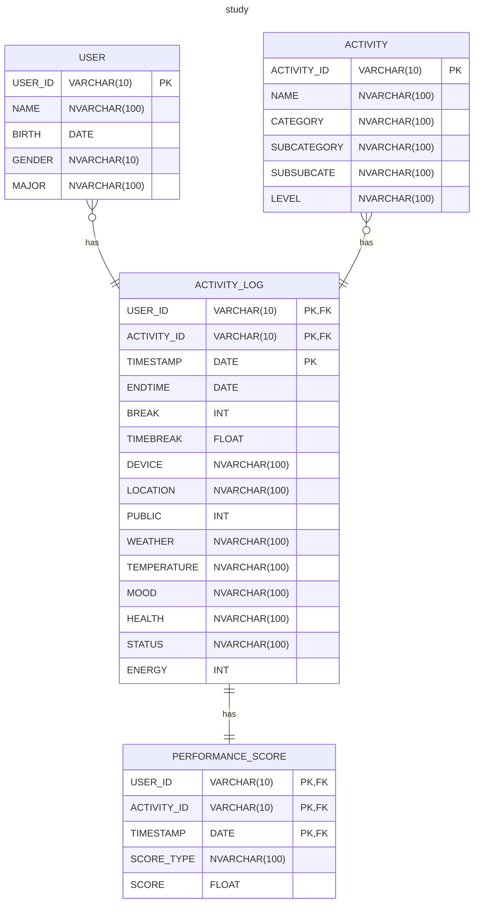

# RDM

```mermaid
---
title: study
---
erDiagram
    
    USER {
        USER_ID VARCHAR(10) PK
        NAME NVARCHAR(100)
        BIRTH DATE
        GENDER NVARCHAR(10)
        MAJOR NVARCHAR(100)
    }

    ACTIVITY {
        ACTIVITY_ID VARCHAR(10) PK
        NAME NVARCHAR(100)
        CATEGORY NVARCHAR(100)
        SUBCATEGORY NVARCHAR(100)
        SUBSUBCATE NVARCHAR(100)
        LEVEL NVARCHAR(100)
    }

    ACTIVITY_LOG {
        USER_ID VARCHAR(10) PK, FK
        ACTIVITY_ID VARCHAR(10) PK, FK
        TIMESTAMP DATE PK
        ENDTIME DATE
        BREAK INT
        TIMEBREAK FLOAT
        DEVICE NVARCHAR(100)
        LOCATION NVARCHAR(100)
        PUBLIC INT
        WEATHER NVARCHAR(100)
        TEMPERATURE NVARCHAR(100)
        MOOD NVARCHAR(100)
        HEALTH NVARCHAR(100)
        STATUS NVARCHAR(100)
        ENERGY INT
    }

    PERFORMANCE_SCORE {
        USER_ID VARCHAR(10) PK, FK
        ACTIVITY_ID VARCHAR(10) PK, FK
        TIMESTAMP DATE PK, FK
        SCORE_TYPE NVARCHAR(100)
        SCORE FLOAT
    }

    USER o{--|| ACTIVITY_LOG : has
    ACTIVITY o{--|| ACTIVITY_LOG : has
    ACTIVITY_LOG ||--|| PERFORMANCE_SCORE : has
```